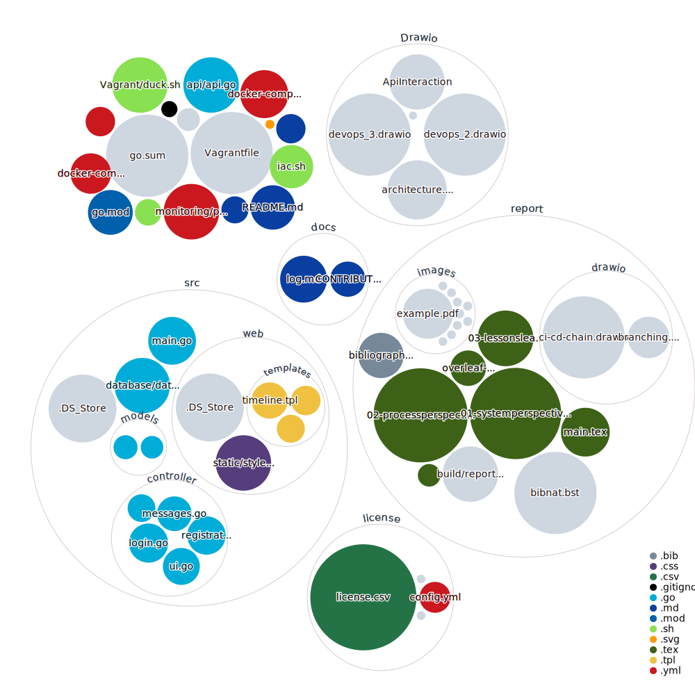

# Go MiniTwit

Store a file with the environment variables in the root directory with the name 
`.minitwit-secrets.env`. 
Make sure this is the exact name and do not store it under version control.

Build the entire application stack:
```
docker compose build
```

To run the entire application stack:
```
docker compose up
```

For every change in the application, repeat the above process with Docker.

## Go Minitwit on DigitalOcean
[](https://www.digitalocean.com/?refcode=7cb197c4e0cb&utm_campaign=Referral_Invite&utm_medium=Referral_Program&utm_source=badge)

We used Vagrant to deploy our application to [DigitalOcean](https://www.digitalocean.com/). Vagrant is a tool that allows us to create and provision virtual machines.
In our case, Vagrant will create a droplet on DigitalOcean and provision it with the necessary software and configuration.
Specifically, it will:
- Update the software on the VM
- Install Go, GCC, and other dependencies necessary for Go-Minitwit
- Clone Go-Minitwit repository
- Build Go-Minitwit application to binary
- Create a `systemd` service
- Start Go-Minitwit service

### 1.1.1. Deploy

In order to deploy the application to DigitalOcean you will need to have Vagrant and Virtualbox installed on your machine. Afterwards, you will need the Vagrant plugin for DigitalOcean.

Install the DigitalOCean plugin: `vagrant plugin install vagrant-digitalocean`

Create your access token [here](https://cloud.digitalocean.com/account/api/tokens)

```shell
export DIGITAL_OCEAN_TOKEN=''
export SSH_KEY_NAME=''
export DUCKDNS_TOKEN=''
```

Make sure that your private key for `$SSH_KEY_NAME` is in your `~/.ssh/` directory.

Run vagrant up:
`vagrant up`

[Access to the application!](http://go-minitwit.duckdns.org)


## 1.2. Development

- Develop locally with `go run src/main.go .` and `go run api/api.go .`
- Test against production by running `docker compose -f docker-compose.devtest.yaml up --build`. For this, you will need to have the environment variables for Bugsnag.

### 1.2.1. Environment variables

Once you have the environment variables, set it up like this:

1. Create a file on your system that contains the environment variables. This SHOULD not be at the project level or anywhere in version control. Example: `~/secrets/go-minitwit`
2. To expose the variables to the running terminal session, do `source ~/secrets/go-minitwit`
3. Confirm that the variables are exposed, example `echo $DOCKER_USERNAME`


### Visualization

